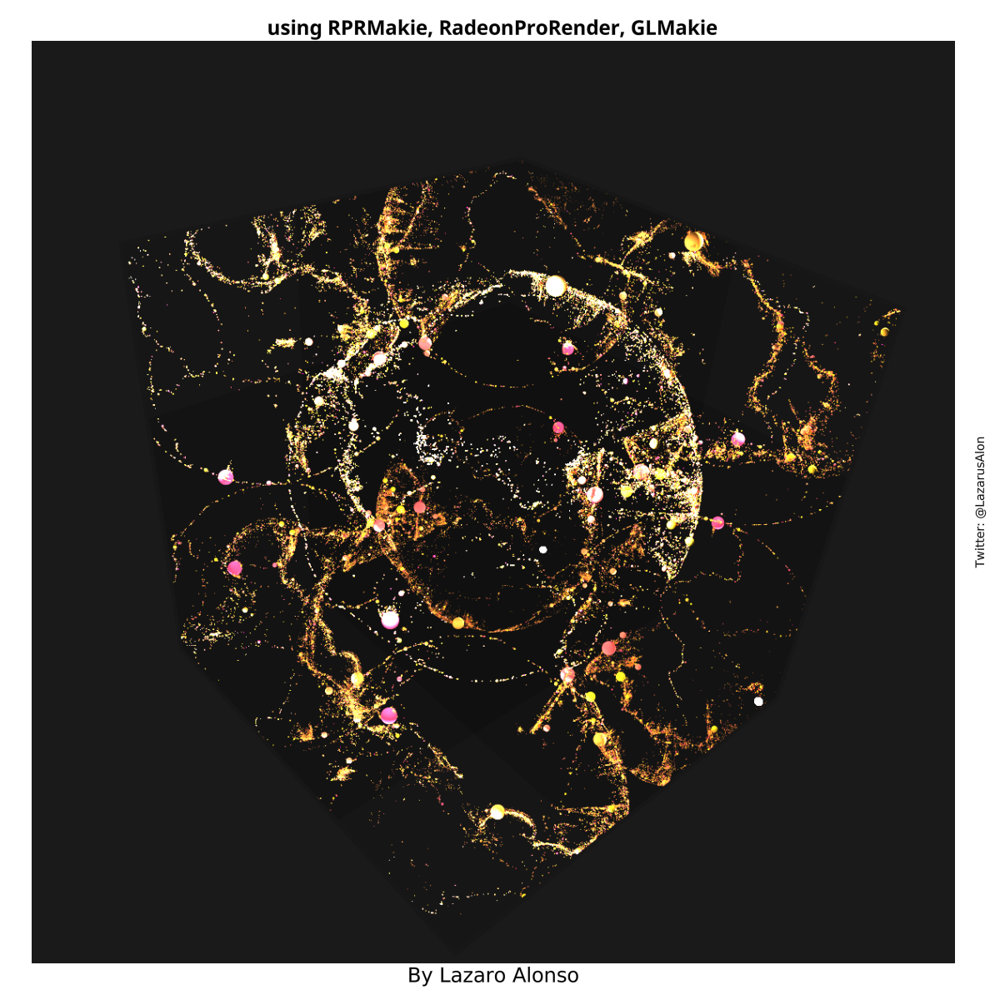

# RPRMakieNotes
Examples and utility scripts

## Prelimilary examples to learn how to use RPRMakie.

### sphere_plane_greysky

### sphere_source_light

### earth_ina_julia_box

### materials_julia_room

### earthquakes, WIP

### A better view ?

- ## TODO (help?):
- connect left scene rotations to fig[1,4]
- connect `eyeposition`, `lookat` and `lightposition`s to fig[2,4].
- connect from fig[1,4] and fig[2,4] to scence on fig[1:3,1:3].
