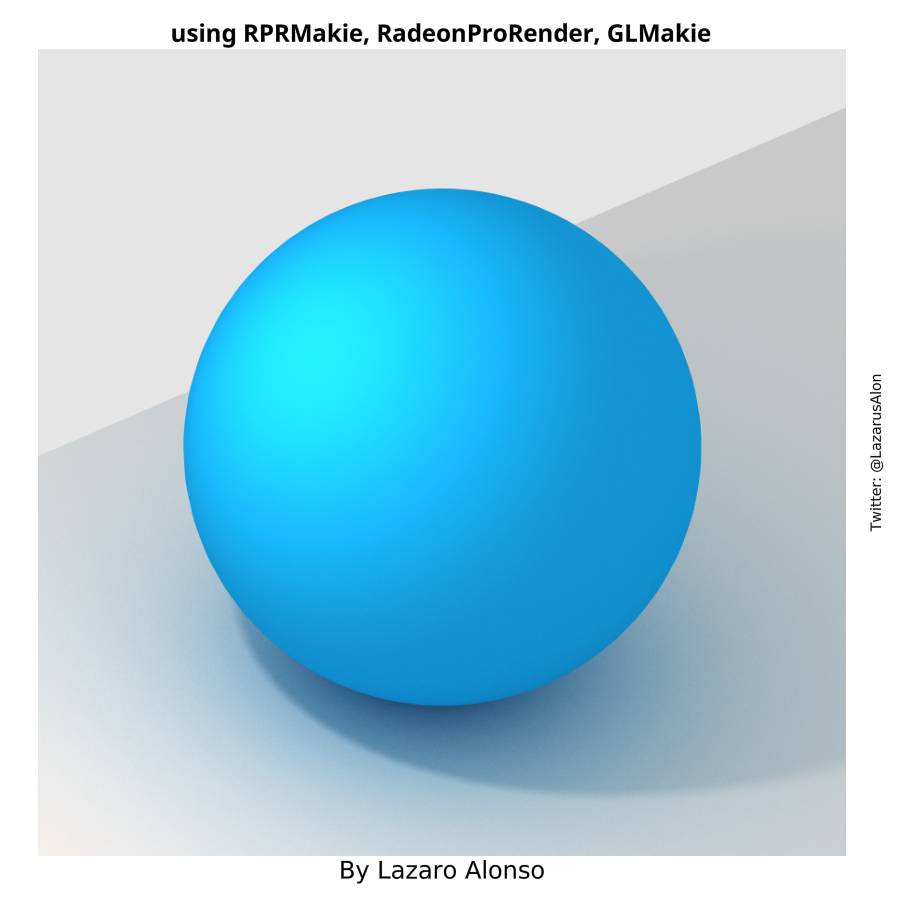
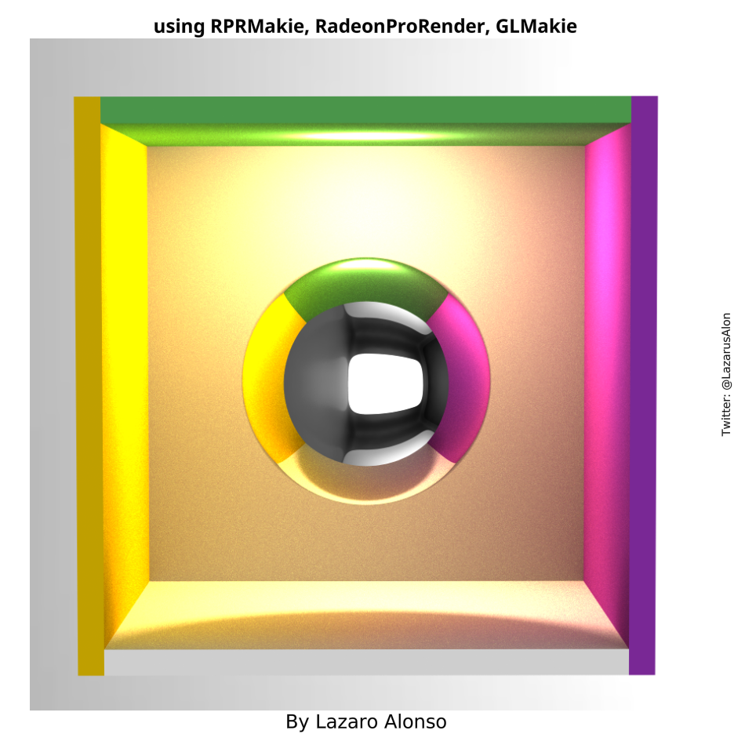
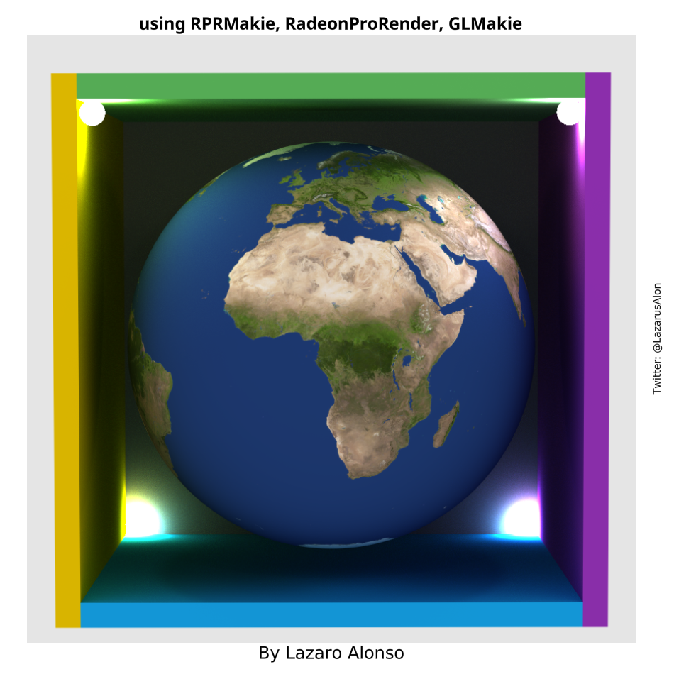
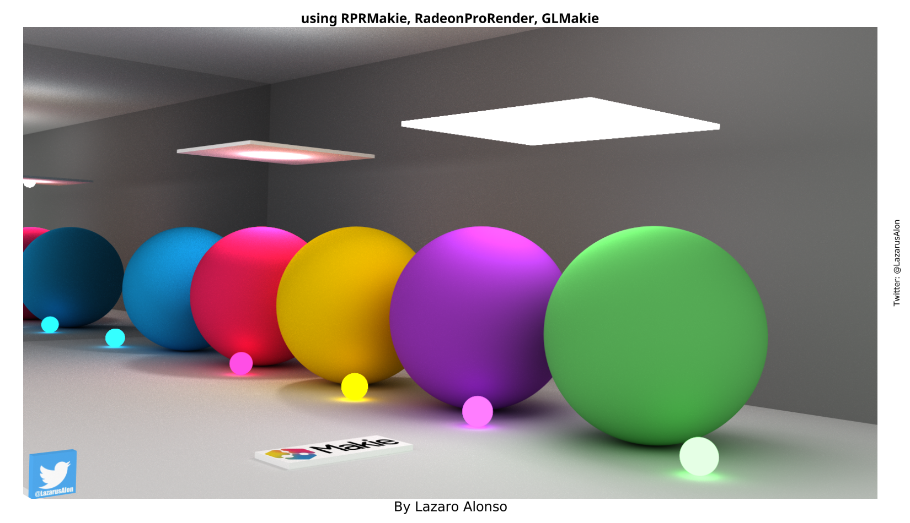
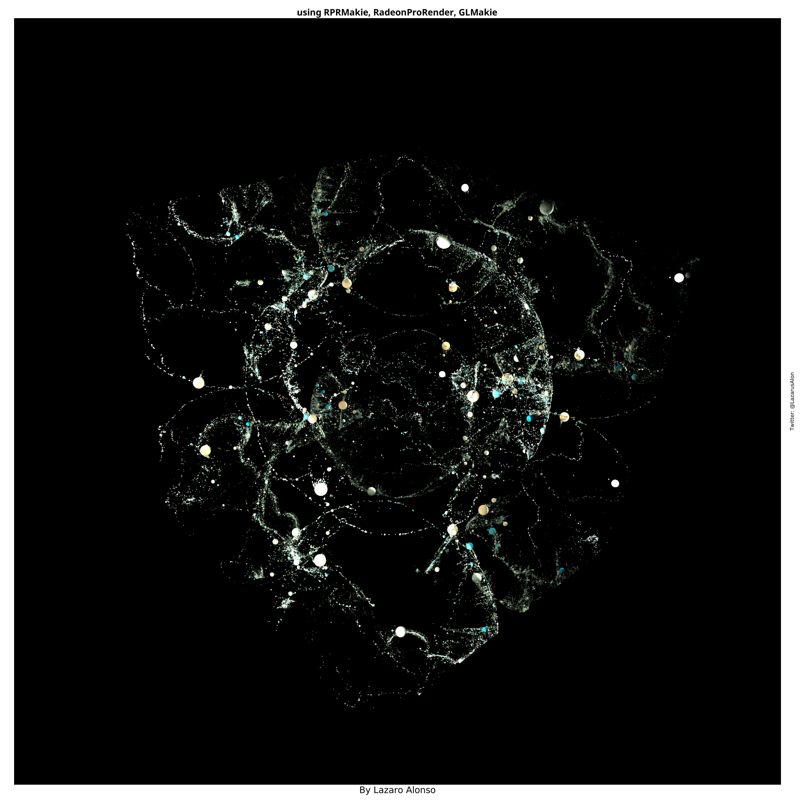
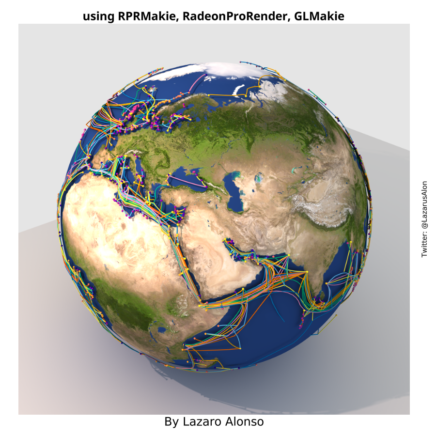
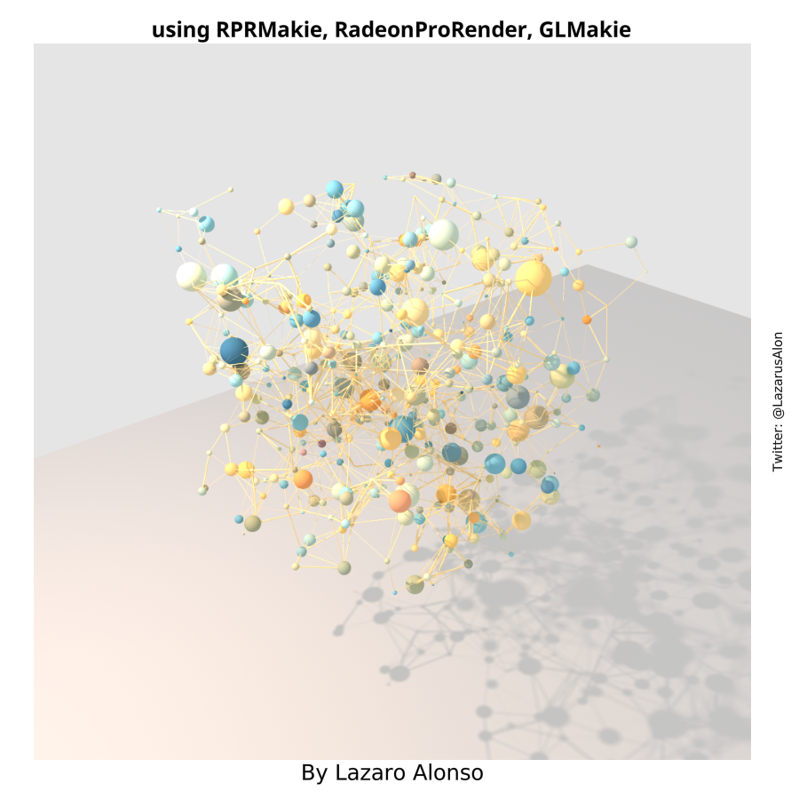
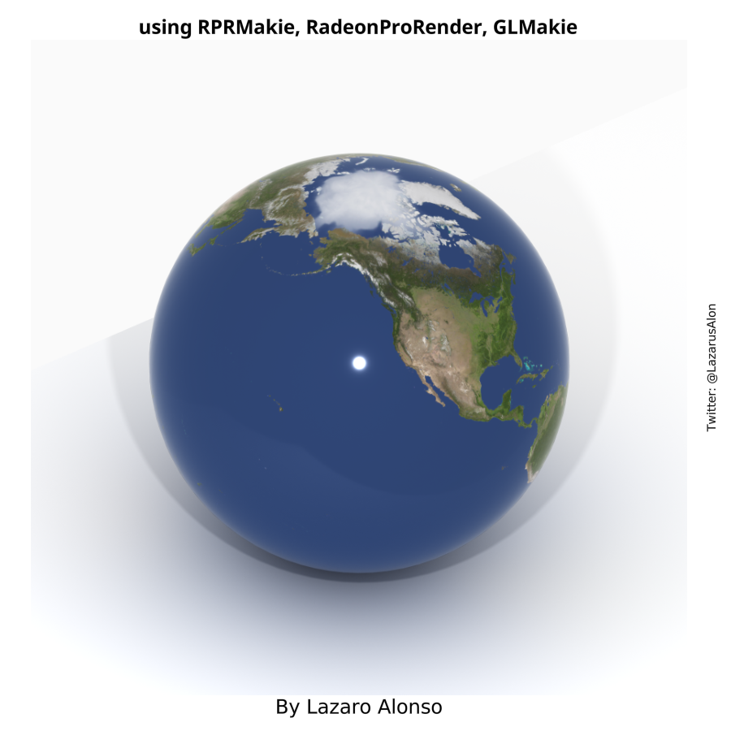
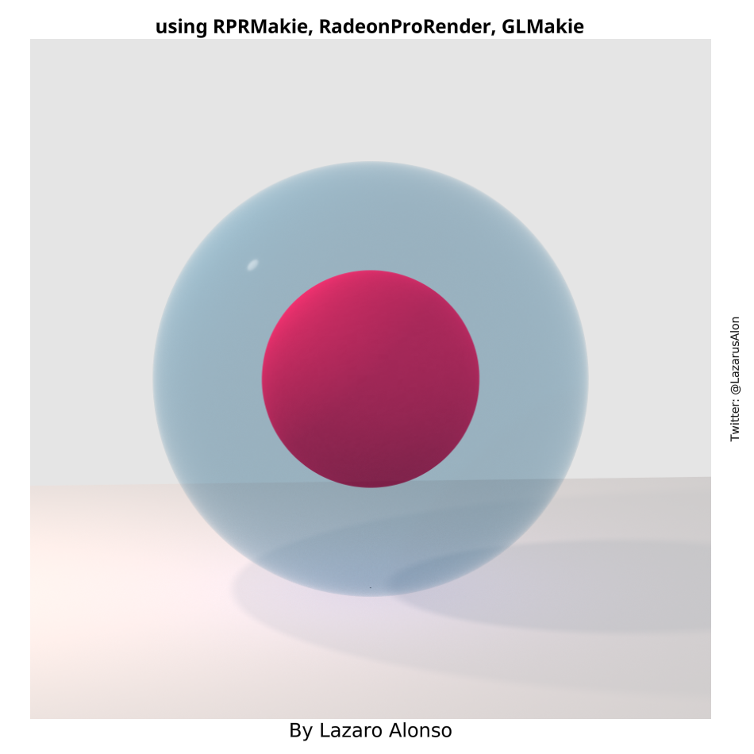
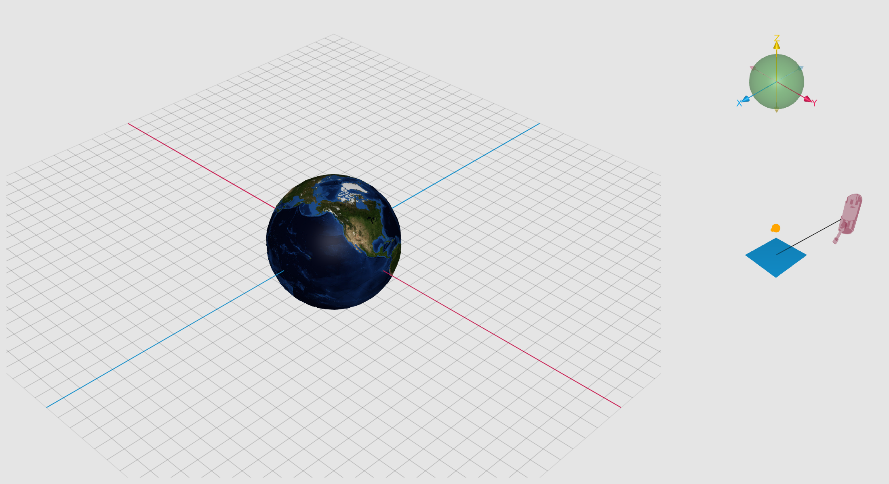

# RPRMakieNotes
Examples and utility scripts.

Prelimilary examples to learn how to use RPRMakie.

### sphere_plane_greysky

<a href="./scripts/sphere_plane_greysky.jl"> 

### sphere_source_light

<a href="./scripts/sphere_source_light.jl"> 

### earth_ina_julia_box

<a href="./scripts/earth_ina_julia_box.jl"> 

### materials_julia_room

<a href="./scripts/materials_julia_room.jl"> 

### earthquakes

<a href="./scripts/earthquakes.jl"> 

### Submarine Cables

<a href="./scripts/submarineCables.jl"> 

### Random Graph

<a href="./scripts/rrg.jl"> 

### UberM Example

<a href="./scripts/uberMExample.jl"> 

### Transparency

<a href="./scripts/transparentM.jl"> 

### A better view ?

- ## TODO (help?):
- connect left scene rotations to fig[1,4]
- connect `eyeposition`, `lookat` and `lightposition`s to fig[2,4].
- connect from fig[1,4] and fig[2,4] to scence on fig[1:3,1:3].
